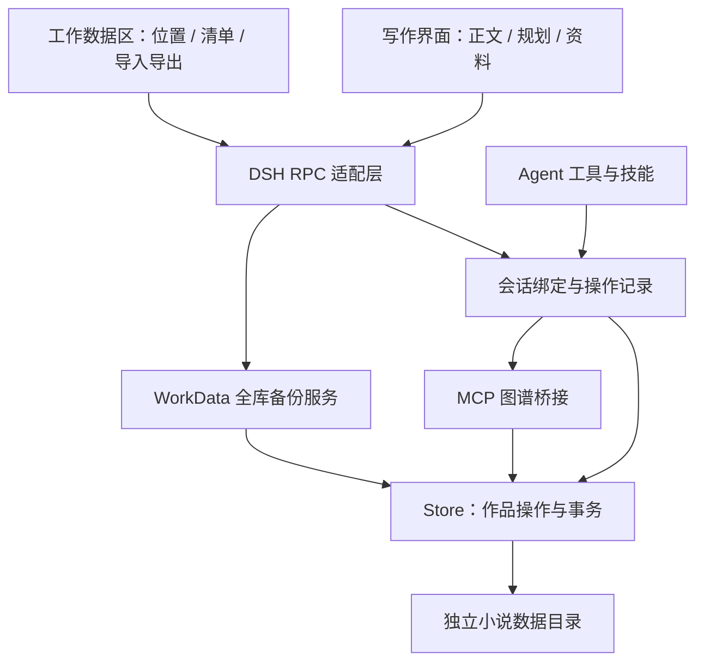

# 催更姬模块与工作数据

- `client/chapters`、`client/planning`、`client/memory`：写作界面，仅使用 RPC，不访问文件系统。
- `client/data`：独立工作数据页面；无需先绑定作品，可查看实际存储目录与全部作品清单。
- `transport/rpc.js`：DSH 通信适配、人类操作入口；不向 Agent 暴露全库导入导出。
- `data/workspace.js`：全库备份格式、SHA-256 校验、冲突预览、合并与导入前备份。
- `assistant`：静态技能、按需读取与会话绑定；不会自动塞小说全文或全库资料。
- `core/store.js`：现阶段仍同时承担作品操作和文件事务，是后续拆分点。规划、预设、上下文已经独立；不要把当前状态称为完整 TypeScript 重构。

## 独立数据目录

配置优先级：插件 `dataRoot` > `CUIGENGJI_DATA_ROOT` > 系统默认目录。桌面启动脚本固定设置 `D:\deepseek-harness\dsh-desktop\cuigengji-data`，与源码、DSH Home 和 Electron 浏览器数据分开。工作数据页显示服务实际使用的绝对路径，迁移应核对作品名称清单，不能只按文件是否复制成功判断。

## 备份契约

单本作品继续使用“作品与备份”。“工作数据 · 导入/导出”使用独立版本化格式 `cuigengji-workspace`，保存整个 Store（含归档作品、删除章节及历史、规划变更、原始预设、绑定和请求记录），并附带操作日志、旧规划迁移备份及校验码。

导入前预览；确认时在同一 Store 锁内重新校验冲突。相同作品跳过，不同内容的同 ID 作品、不同绑定或分叉日志拒绝导入。当前工作数据先存入 `backups/before-import-*`，再合并；源备份不修改。相同日志的前缀版本保留较长一份。导入前备份是本机回滚快照，不递归打包进后续导出，避免备份无限膨胀。

这是小说工作数据备份，不是 DSH 整机备份：聊天记录、附件、凭据由 DSH 管理，浏览器未保存草稿需先保存。备份预览会明确提示边界。恢复会话绑定依赖相同的 DSH 会话 ID；只迁移小说时仍可在新会话手动选择作品。

## 后续解耦边界

保持接口不变，可进一步将 Store 拆为 Repository（锁和原子写入）、Novel/Chapter 服务（版本与校验）、Graph 服务，以及独立备份校验器；以数据回归测试保证旧版文件可读。本次没有重写整个核心，也没有改变按需读取和 Agent 写作助手定位。
